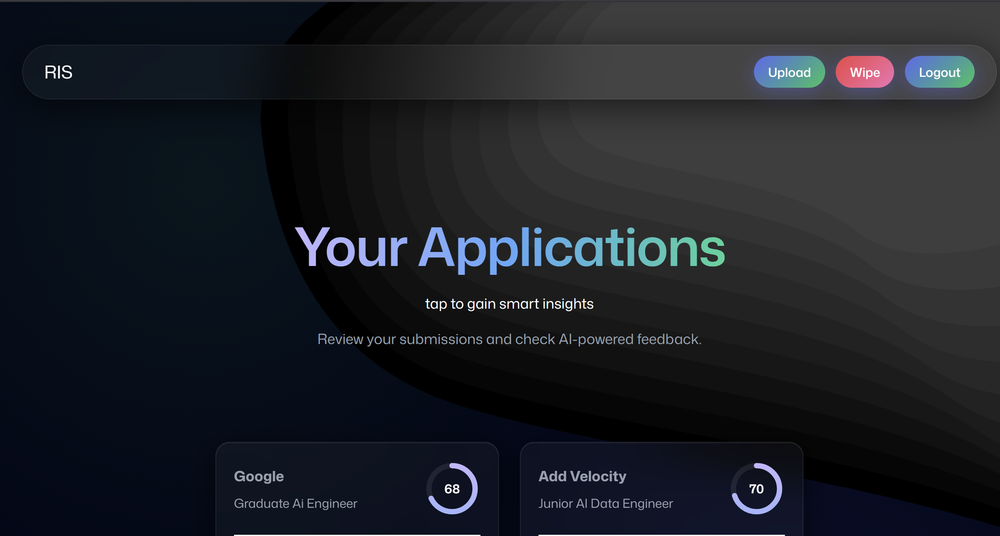
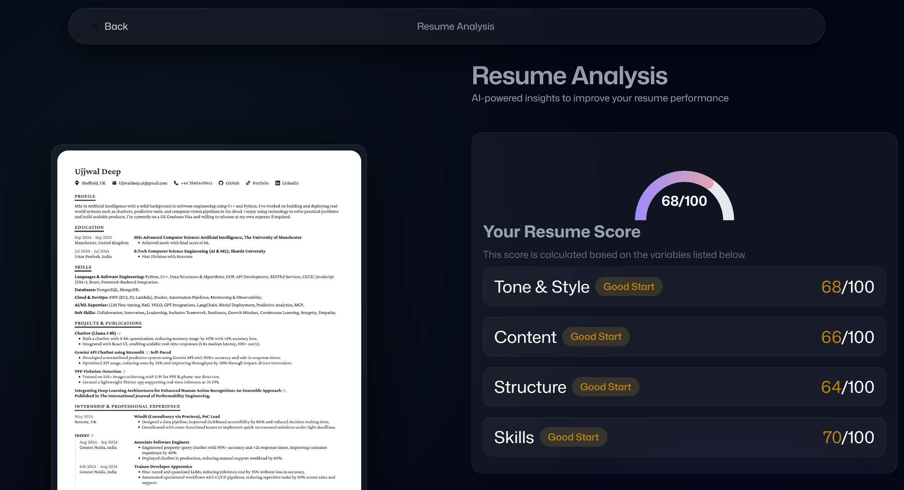
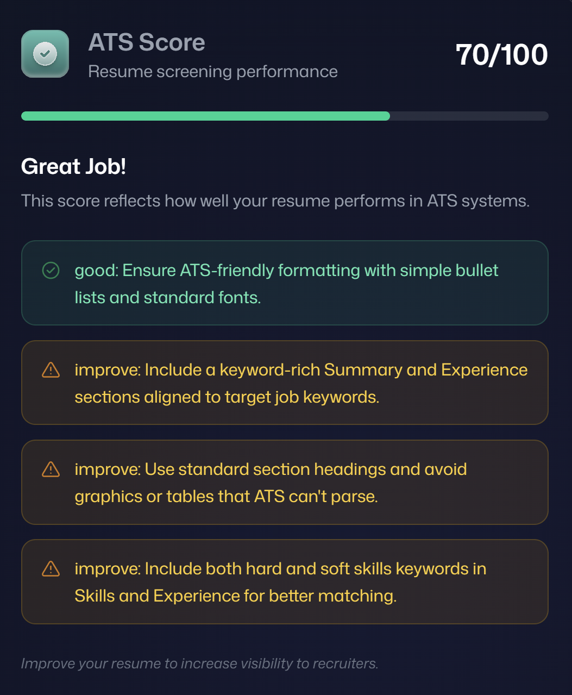
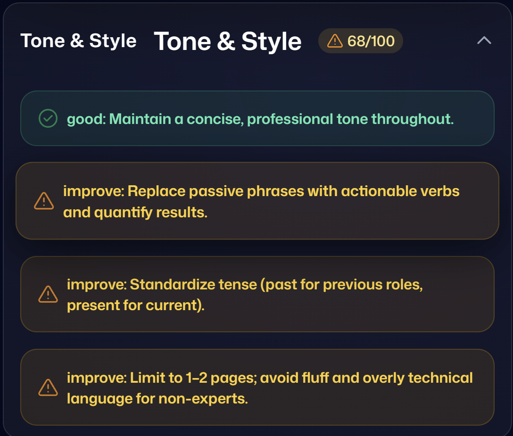
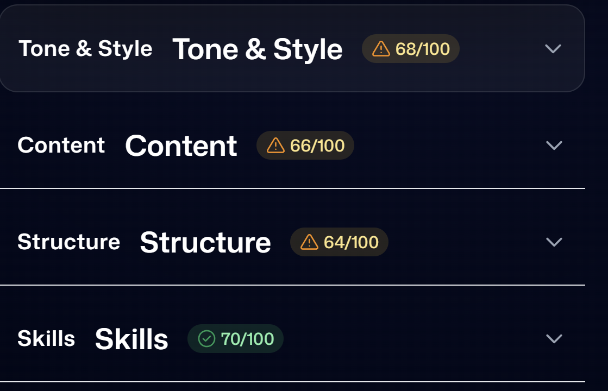
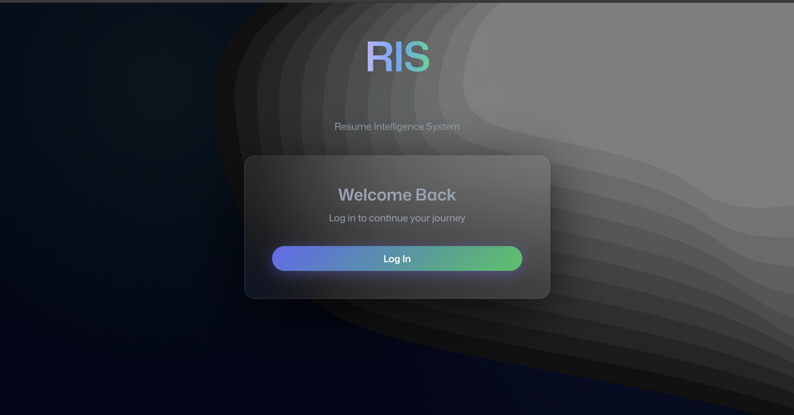

# 🚀 RIS — Resume Intelligence System

> AI-powered resume analysis platform that delivers structured, ATS-focused feedback with a polished, modern UI.

---

## ✨ Overview

RIS (Resume Intelligence System) helps users evaluate and improve their resumes using AI. It analyzes resumes across multiple dimensions such as ATS compatibility, tone, content, structure, and skills — and presents the results in a clean, intuitive interface.

This project focuses not just on using AI, but on **controlling, structuring, and rendering AI outputs reliably** in a real-world application.

---

## 📸 Screenshots

<p align="center">
  
  
  
</p>

<p align="center">
  <b>Dashboard</b> &nbsp;&nbsp;&nbsp;&nbsp;
  <b>Resume Analysis</b> &nbsp;&nbsp;&nbsp;&nbsp;
  <b>ATS Feedback</b>
</p>

<p align="center">
  
  
  
</p>

<p align="center">
  <b>Detailed Insights</b> &nbsp;&nbsp;&nbsp;&nbsp;
  <b>Score Breakdown</b> &nbsp;&nbsp;&nbsp;&nbsp;
  <b>Authentication</b>
</p>

---

## 🧠 Key Features

* 📄 Resume Upload & Processing
* 🧠 AI-Powered Structured Feedback
* 📊 Score Visualization (Gauge + Section Scores)
* 📌 Section-wise Improvement Suggestions
* 🔗 Optional Job Link Context Integration
* ⚡ Real-time Rendering with Clean UI
* 💾 Persistent Storage (KV + File System)
* 🎯 ATS Optimization Insights

---

## 🛠️ Tech Stack

### Frontend

* React (Hooks)
* TypeScript
* Tailwind CSS
* React Router

### Backend / Infra

* Puter (KV Store, File Storage, Auth)
* PDF → Image conversion pipeline
* UUID-based document tracking

### AI Layer

* Prompt Engineering
* Structured JSON enforcement
* Response normalization layer

---

## ⚙️ Architecture Highlights

* **AI → Normalization → UI Pipeline**
* Handles **multiple AI response formats**
* Defensive parsing to prevent crashes
* Clean separation:

  * Upload logic
  * AI processing
  * Data normalization
  * UI rendering

---

## 🚧 Challenges Faced

### 1. AI Output Inconsistency

* AI returned different formats (`sections[]` vs structured keys)

**Solution:**

* Built a **universal normalization layer** to handle multiple schemas

---

### 2. Silent UI Failures

* Data existed but UI showed nothing (field mismatch issues)

**Solution:**

* Enforced a consistent internal schema (`tip` vs `text`)
* Added debugging + fallback mapping

---

### 3. Prompt Reliability Issues

* AI ignored strict formatting instructions

**Solution:**

* Rewrote prompts using:

  * strict JSON constraints
  * schema examples
  * explicit rules

---

### 4. State & Rendering Bugs

* Data loaded but not reflected in UI

**Solution:**

* Improved state management with React hooks
* Ensured proper data flow and reactivity

---

## 📈 Skills & Learnings

### 🧠 AI Engineering

* Advanced prompt engineering
* Handling non-deterministic outputs
* Schema enforcement strategies

### ⚛️ Frontend Development

* Debugging complex rendering issues
* Designing state-driven UI systems
* Component-level data contracts

### 🏗️ System Design

* Building resilient pipelines
* Data normalization patterns
* Designing for failure (AI unpredictability)

### 🧪 Debugging Mindset

* Identifying root causes vs symptoms
* Handling silent failures effectively
* Using logs strategically

---

## 🔥 What Makes This Project Stand Out

* Goes beyond basic AI usage → **controls and structures AI output**
* Handles real-world unpredictability gracefully
* Clean UI + strong backend logic
* Built with **product-level thinking**, not just as a demo

---

## 🚀 Future Improvements

* 🔍 Auto-fetch job description from URL
* 📊 Resume vs Job Match Score
* 🧠 Keyword gap analysis
* 🏢 Company logo extraction
* 📈 Resume history tracking
* 📄 Export feedback as PDF

---

## 🧑‍💻 Getting Started

```bash
git clone https://github.com/UjjwalDeepXCIX/RIS.git
cd ris
npm install
npm run dev
```

---

## 💡 Final Note

This project evolved from:

> “A simple AI resume checker”

to:

> **A structured, resilient AI-powered system designed for real-world usage**

---

## 🤝 Contributing

Open to improvements, suggestions, and collaborations.

---

## 📬 Contact

**Ujjwal Deep**
(Add your GitHub / LinkedIn here)

---

⭐ If you found this useful, consider giving it a star!
